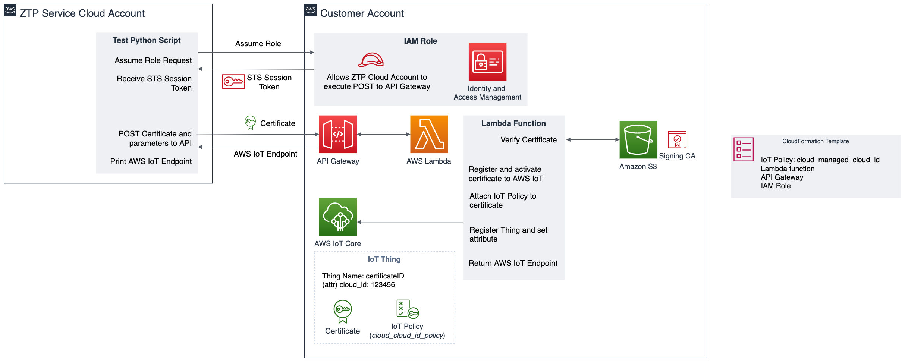

# Register Certificate and Thing API for Zero Touch Provisioning Architecture
This example includes a CloudFormation template that deploys the following architecture in a customer's account:



This will deploy a serverless API that accepts a certificate and Thing Attribute in the body. It will validate the certificate against root_ca.pem stored in Amazon S3 and then register an IoT Thing, Certificate and IoT policy. The Thing Name is tightly coupled to the fingerprint of the certificate (the certificate ID). 

This example can be used for service providers who wish to deploy a Zero Touch Provisioning service. The architecture should be deployed in the ZTP service provider's customer's AWS account. The ZTP service provider will then be able to register certificates and IoT Things in the customer's account securely. An IAM Role is set up in the customer's account that only allows the ZTP service provider to access and POST to the API. If the Thing and certificate registration was successful, the customer's AWS IoT Endpoint will be returned. This could be forwarded to the device connected to the ZTP Provisioning Service and the device can then connect to the customer's AWS IoT endpoint.

The example only allows for ECC certificates to cover the most common use cases including HSM secure element vendors. The Lambda function could be modified to validate RSA certificates as well.

## Deployment

### Provide Signing Certificate Authority: root_ca.pem
root_ca.pem should be the signer certificate authority for the certificates to be loaded to the customer's account. The default root_ca.pem included in this example is a dummy CA used for testing purposes. 

You can provide the signer CA or generate a self signed certificate:
```
openssl ecparam -out ec-cakey.pem -name prime256v1 -genkey
openssl req -new -x509 -days 3650 -config openssl.cnf -extensions v3_ca -key ec-cakey.pem -out root_ca.pem
```

### Change parameters in deploy.sh
 * Change AWS_REGION to the region in which the API should be deployed.
 * Change ATTRIBUTE_NAME to the name of an attribute that is unique to each device, for example 'cloud_managed_id' where the corresponding attribute is an identifier known to the ZTP provisioning service.
 * Change CLOUD_MANAGED_SERVICE_ACCOUNT_ID to the AWS Account ID of the ZTP provisioning service that will have access to the API.

### Deploy the stack
```
./deploy.sh
```
The output of this script should look like the following:

```

[
    {
        "Description": "Role for the ZTP Provisioning Service to Assume", 
        "OutputKey": "RoleToAssume", 
        "OutputValue": "arn:aws:iam::123456789012:role/CloudManagedRoleForAPIAccess"
    }, 
    {
        "OutputKey": "APIUrlForRegisterAPI", 
        "OutputValue": "https://abcdefghij.execute-api.us-east-1.amazonaws.com/Prod/register"
    }
]
```

The OutputValue for RoleToAssume and APIURLForRegisterAPI should be provided to the Zero Touch Provisioning service provider.

### Testing
There is a provided Python script, partner_test.py, that assumes the specified role and executes the API. The script must run from the Zero Touch Provisioning service provider where the Account ID is CLOUD_MANAGED_SERVICE_ACCOUNT_ID in deploy.sh. It will register a dummy Thing and Certificate signed with the root_ca.pem provided in this repository.

First, update the role to the value of RoleToAssume:
```
sts_response = assume_role('arn:aws:iam::123456789012:role/CloudManagedRoleForAPIAccess','testsession')
```

Next, update the URL for the API request to the value of APIURLForRegisterAPI:
```
url = 'https://abcdefghij.execute-api.us-east-1.amazonaws.com/Prod/register'
```

Update the certificate in the Python script to the certificate you would like to register. It must be signed with root_ca.pem. The default certificate in the script is a dummy certificate signed by the dummy root_ca.pem. It will work if you have not changed root_ca.pem. 

You can generate a device certificate from a self-signed CA:
```
openssl ecparam -out client.key -name prime256v1 -genkey
openssl req -new -key client.key -out client.csr -sha256
openssl x509 -req -in client.csr -CA root_ca.pem -CAkey ec-cakey.pem -CAcreateserial -out client.pem -days 1000 -sha256
```

Input the contents of client.pem to partner_test.py:
```
body = {
  "region": "us-east-1",
  "certificate": "-----BEGIN CERTIFICATE-----\nMIIB5TCCAYoCCQD0QhU41DbVtzAKBggqhkjOPQQDAjBzMQswCQYDVQQGEwJVUzEQ\nMA4GA1UECAwHVVNTdGF0ZTEQMA4GA1UEBwwHQW55dG93bjEXMBUGA1UECgwORHVt\nbXlDb3JwIEx0ZC4xEzARBgNVBAsMCklvVFNlY3Rpb24xEjAQBgNVBAMMCUR1bW15\nQ29ycDAeFw0yMTA5MTUwMjAyMDFaFw0yNDA2MTEwMjAyMDFaMIGAMQswCQYDVQQG\nEwJVUzETMBEGA1UECAwKV2FzaGluZ3RvbjEQMA4GA1UEBwwHU2VhdHRsZTEQMA4G\nA1UECgwHSW9UQ29ycDEXMBUGA1UECwwOSW9UQ29ycERldmljZXMxHzAdBgNVBAMM\nFklvVENvcnBJb1RQbGF0Zm9ybS5jb20wWTATBgcqhkjOPQIBBggqhkjOPQMBBwNC\nAAQjOn6W5yp/2WKj5avLAbR7SL7cnVsoEwZjep9gPX+jRccNmTgh/CnqtMtHgDN4\nWB+lgwdHsf5Oi5dKel0S3RjxMAoGCCqGSM49BAMCA0kAMEYCIQDWYHe5WtuhE7i1\n2DMIZMNSHrvzYh10HUPY1XvKMf+gTwIhALxeRADj8KEAN0+E133Eek0p3Yb7IO9i\n2vym8IH/Pu4C\n-----END CERTIFICATE-----",
  "cloud_managed_id": "123456789"
}
```

Finally, execute the script:
```
python3 partner_test.py
```
The certificate and AWS IoT Thing will be set up in the customer's account. The AWS IoT Endpoint from the customer will be returned.


